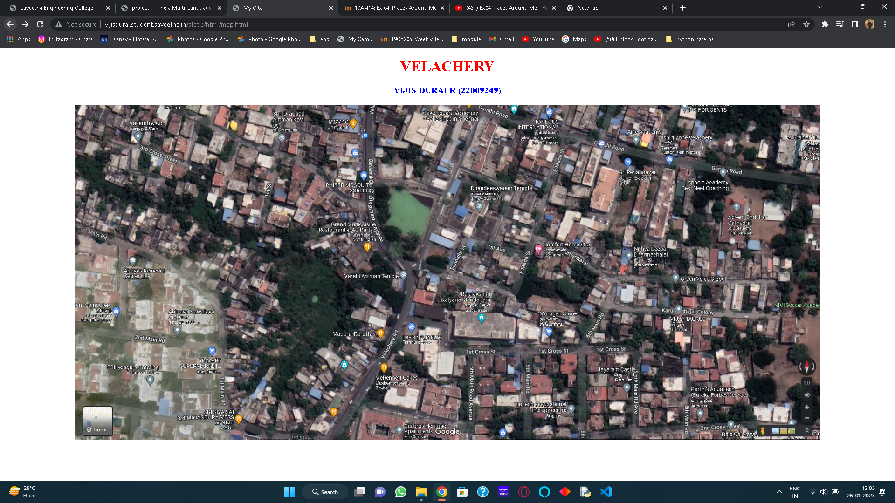
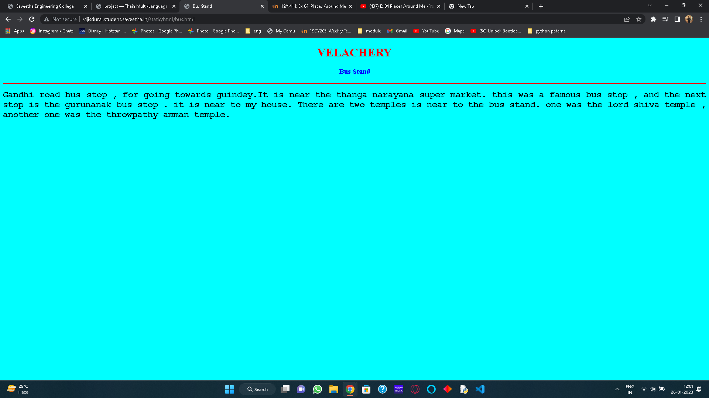
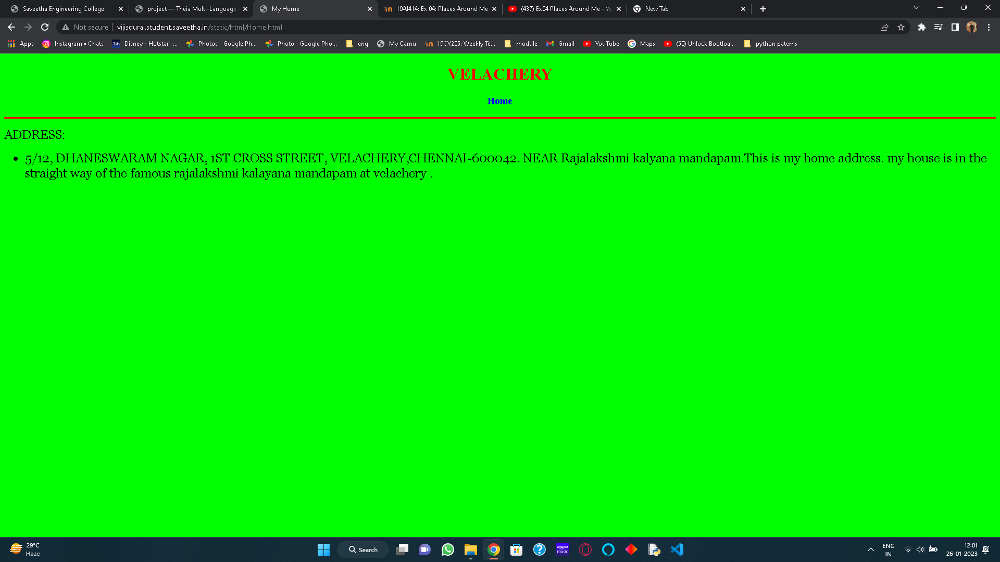
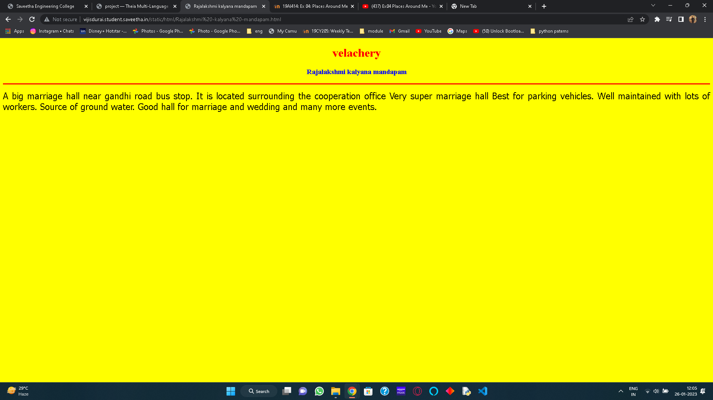
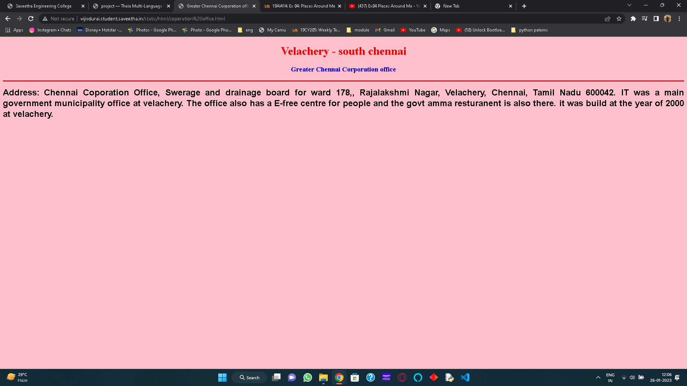
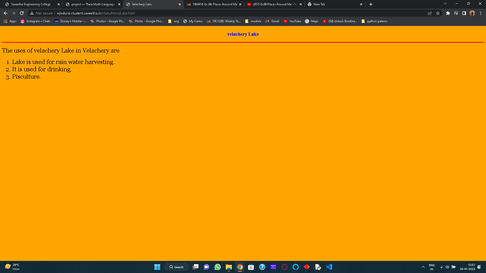
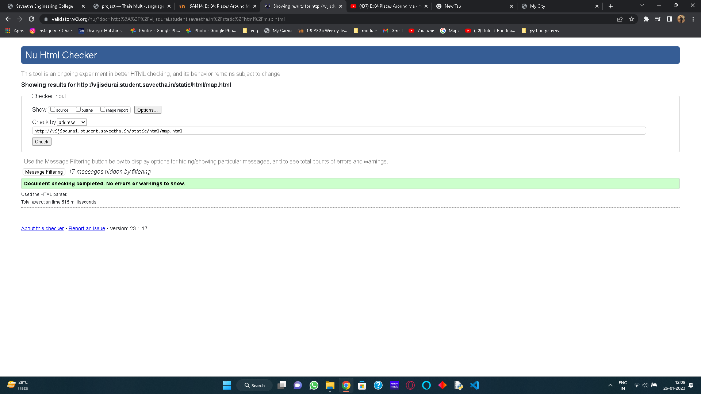

# Places Around Me
## AIM:
To develop a website to display details about the places around my house.

## Design Steps:

### Step 1:
Clone the github repository into the THIA IDE.

### Step 2:
Create a new django project

### step 3:
Write the need HTML code.

### step 4:
Run the django server and execute the HTML files.

## Code:
```
map.html

<!DOCTYPE html>
<html lang="en">
<head>
<title>My City</title>
</head>
<body>
<h1 align="center">
<font color="red"><b>VELACHERY</b></font>
</h1>
<h3 align="center">
<font color="blue"><b>VIJIS DURAI R (22009249)</b></font>
</h3>
<center>

<map name="MyCity">
<area shape="circle" coords="190,50,20" href="/static/html/Rajalakshmi -kalyana -mandapam.html" title="Rajalakshmi kalyana mandapam">
<area shape="rectangle" coords="230,30,260,60" href="/static/html/coperation office.html" title="Greater Chennai Corporation">
<area shape="circle" coords="400,350,50" href="/static/html/Lake.html" title="velachery Lake">
<area shape="circle" coords="400,200,75" href="/static/html/bus.html" title="Bus Stand">
<area shape="rectangle" coords="490,150,870,320" href="/static/html/Home.html" title="Home">
</map>
</center>
</body>
</html>

bus.html

<!DOCTYPE html>
<html lang="en">
<head>
<title>Bus Stand</title>
</head>
<body bgcolor="cyan">
<h1 align="center">
<font color="red"><b>VELACHERY</b></font>
</h1>
<h3 align="center">
<font color="blue"><b>Bus Stand</b></font>
</h3>
<hr size="3" color="red">
<p align="justify">
<font face="Courier New" size="5">
<b>
Gandhi road bus stop , for going towards guindey.It is near the thanga narayana super market.
this was a famous bus stop , and the next stop is the gurunanak bus stop . it is near to my house.
There are two temples is near to the bus stand. one was the lord shiva temple , another one was the throwpathy amman temple. 
</b>
</font>
</p>
</body>
</html>

coperation office.html

<!DOCTYPE html>
<html lang="en">
<head>
<title>Greater Chennai Corporation office</title>
</head>
<body bgcolor="pink">
<h1 align="center">
<font color="red"><b>Velachery - south chennai</b></font>
</h1>
<h3 align="center">
<font color="blue"><b>Greater Chennai Corporation office</b></font>
</h3>
<hr size="3" color="red">
<p align="justify">
<font face="Arial" size="5">
<b>
Address:
Chennai Coporation Office, Swerage and drainage board for ward 178,, Rajalakshmi Nagar, Velachery, Chennai, Tamil Nadu 600042.
IT was a main government municipality office at velachery. The office also has a E-free centre for people and the govt amma resturanent is also there.
it was build at the year of 2000 at velachery.
</b>
</font>
</p>
</body>
</html>

Home.html

<!DOCTYPE html>
<html lang="en">
<head>
<title>My Home</title>
</head>
<body bgcolor="lime">
<h1 align="center">
<font color="red"><b>VELACHERY</b></font>
</h1>
<h3 align="center">
<font color="blue"><b>Home</b></font>
</h3>
<hr size="3" color="red">
<p align="justify">
<font face="Georgia" size="5">
ADDRESS:
<ul>
    <LI>5/12, DHANESWARAM NAGAR, 1ST CROSS STREET, VELACHERY,CHENNAI-600042.
        NEAR Rajalakshmi kalyana mandapam.This is my home address.
        my house is in the straight way of the famous rajalakshmi kalayana mandapam at velachery .
    </LI>
</ul>
</font>
</p>
</body>
</html>

Lake.html

<!DOCTYPE html>
<html lang="en">
<head>
<title>Velachery Lake</title>
</head>
<body bgcolor="orange">
<h1 align="center">
<font color="red"><VELACHERY</b></font>
</h1>
<h3 align="center">
<font color="blue"><b>velachery Lake</b></font>
</h3>
<hr size="3" color="red">
<p align="justify">
<font face="Georgia" size="5">
The uses of velachery Lake in Velachery are 
<ol type="1">
<li>Lake is used for rain water harvesting.</li>
<li>It is used for drinking.</li>
<li>Pisculture.</li>
</ol>
</font>
</p>
</body>
</html>

Rajalakshmi -kalyana -mandapam.html

<!DOCTYPE html>
<html lang="en">
<head>
<title>Rajalakshmi kalyana mandapam</title>
</head>
<body bgcolor="yellow">
<h1 align="center">
<font color="red"><b>velachery</b></font>
</h1>
<h3 align="center">
<font color="blue"><b>Rajalakshmi kalyana mandapam</b></font>
</h3>
<hr size="3" color="red">
<p align="justify">
<font face="Tahoma" size="5">
A big marriage hall  near gandhi road bus stop. It is located surrounding the  cooperation office 
Very super marriage hall Best for parking vehicles. 
Well maintained with lots of workers. Source of ground water.
Good hall for marriage and wedding and many more events.
</font>
</p>
</body>
</html>
```

## Output:







## validator:


## Result:
The program is implementing image  map is executed successfully.